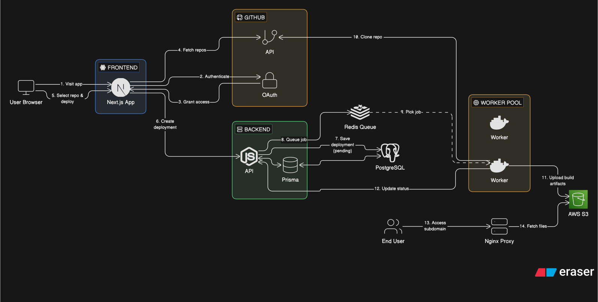

# 🚀 ShipIt

ShipIt is a self-hosted deployment platform inspired by Vercel.
Connect your GitHub repo, trigger a build, and get a live URL — powered by Docker workers, Redis queues, and S3 hosting.

---

## ✨ What ShipIt Does

- 🔐 Sign in with GitHub (private + public repos)
- 📦 Deploy projects from GitHub or public repo URLs
- 🧵 Async build pipeline using Redis queues
- 🐳 Isolated Docker builds per deployment
- ☁️ Uploads build artifacts to AWS S3
- 🌐 Serves deployments via subdomains using Nginx proxy
- 📊 Tracks deployment status (pending → building → success / failed)

---

## 🏗️ Architecture

The diagram below represents the current production architecture of ShipIt:

> Flow: GitHub OAuth → Repo selection → Redis queue → Docker workers → S3 → Nginx proxy → Live URL

---

## 🎯 Why ShipIt?

ShipIt is built to explore real-world deployment system design:

- async job queues
- worker-based build systems
- containerized execution
- static asset hosting
- subdomain routing

This project focuses on **infra + system design fundamentals** behind modern deployment platforms.
