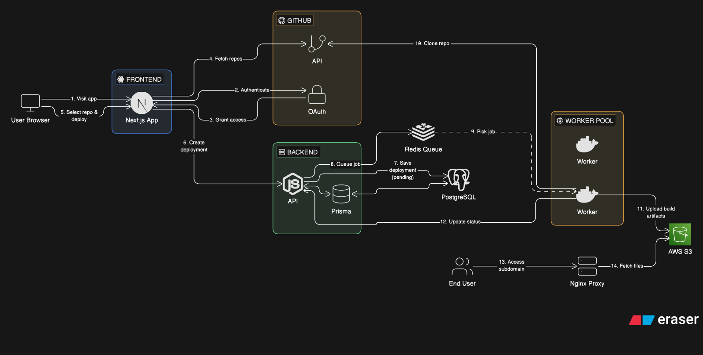

# 🚀 ShipIt

ShipIt is a self-hosted deployment platform inspired by Vercel.
Connect your GitHub repo, trigger a build, and get a live URL — powered by Docker workers, Redis queues, and S3 hosting.

---

## ✨ What ShipIt Does

- 🔐 Sign in with GitHub (private + public repos)
- 📦 Deploy projects from GitHub or public repo URLs
- 🧵 Async build pipeline using Redis queues
- 🐳 Isolated Docker builds per deployment
- ☁️ Uploads build artifacts to AWS S3
- 🌐 Serves deployments via subdomains using Nginx proxy
- 📊 Tracks deployment status (pending → building → success / failed)

---

## 🏗️ Architecture

The diagram below represents the current production architecture of ShipIt:

> Flow: GitHub OAuth → Repo selection → Redis queue → Docker workers → S3 → Nginx proxy → Live URL

---

## 🔑 GitHub OAuth setup

ShipIt needs an **OAuth App** — not a GitHub App. Create one at
**Settings → Developer settings → OAuth Apps → New OAuth App**:

| Field                      | Value                                            |
| -------------------------- | ------------------------------------------------ |
| Homepage URL               | `http://localhost:3000`                          |
| Authorization callback URL | `http://localhost:3000/api/auth/callback/github` |

The callback URL must match `${BETTER_AUTH_URL}/api/auth/callback/github`
**character for character** — any difference (port, trailing slash, `127.0.0.1`
vs `localhost`) makes GitHub reject the sign-in with _"The redirect_uri is not
associated with this application."_ `BETTER_AUTH_URL` points at the **web** app,
because that's what serves `/api/auth`, not the backend.

Copy the client ID and secret into `GITHUB_CLIENT_ID` / `GITHUB_CLIENT_SECRET`.
An OAuth App client ID is 20 hex characters. If yours starts with `Iv23li` or
`Iv1.` it's a **GitHub App**, which won't work here: GitHub Apps ignore the
`repo` scope and issue short-lived tokens limited to repositories where the App
is installed, so Shipyard can't clone private repos with them.

---

## 🎯 Why ShipIt?

ShipIt is built to explore real-world deployment system design:

- async job queues
- worker-based build systems
- containerized execution
- static asset hosting
- subdomain routing

This project focuses on **infra + system design fundamentals** behind modern deployment platforms.
